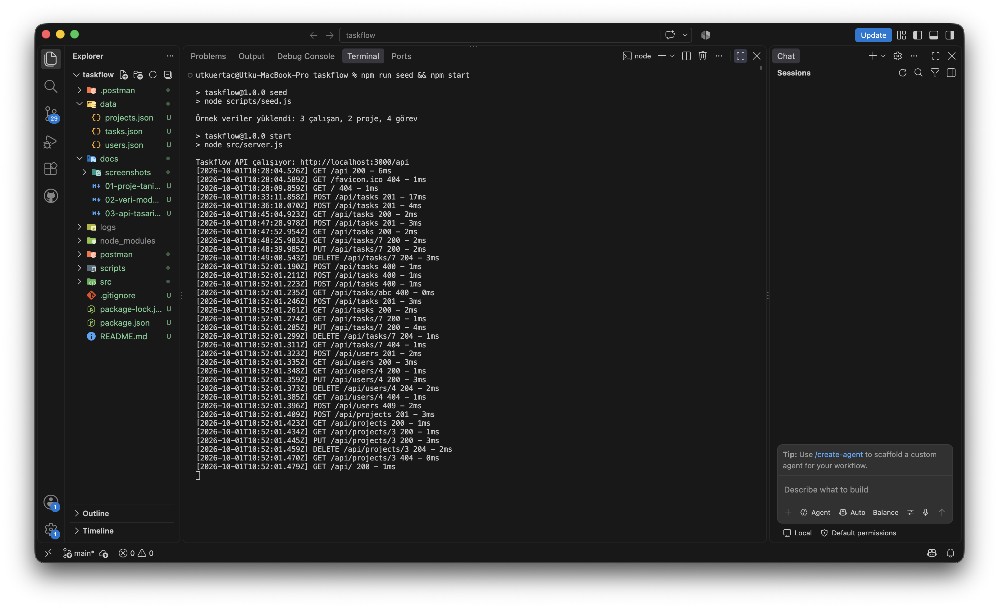
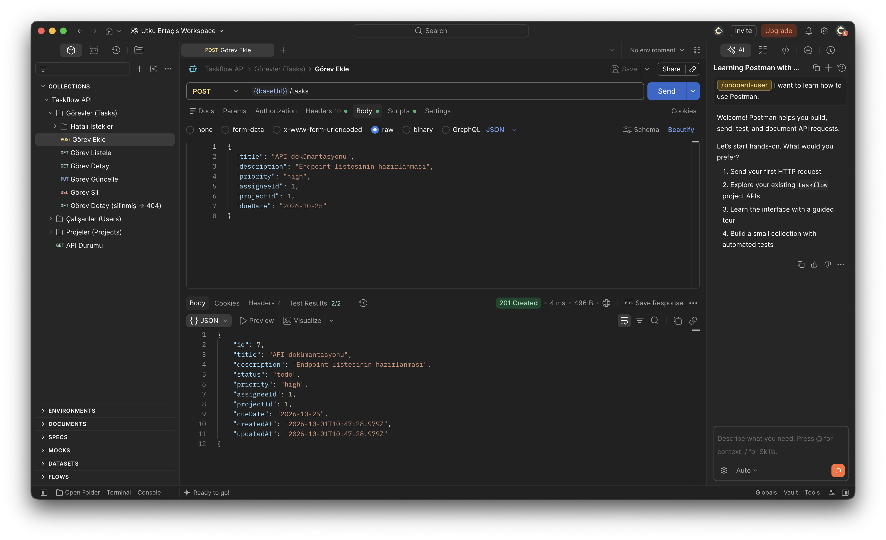
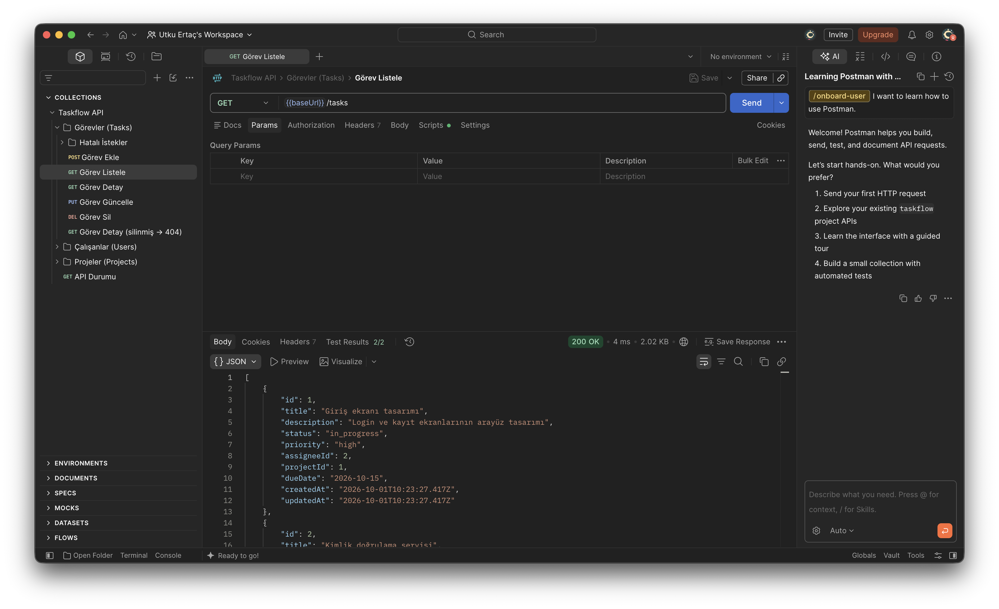
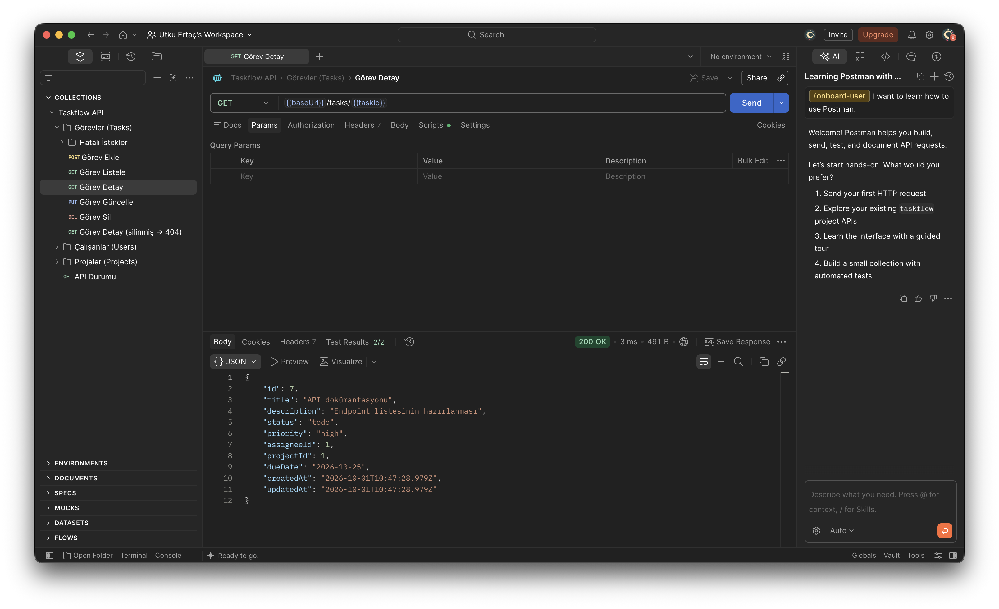
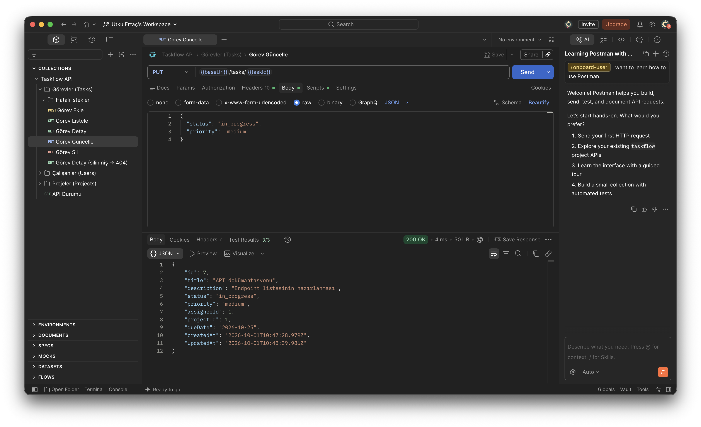
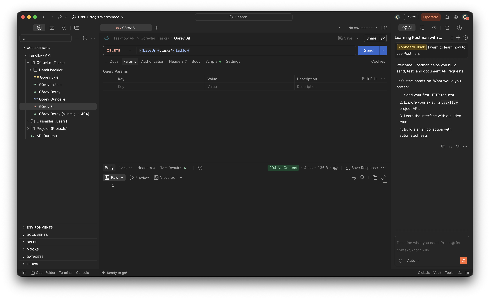
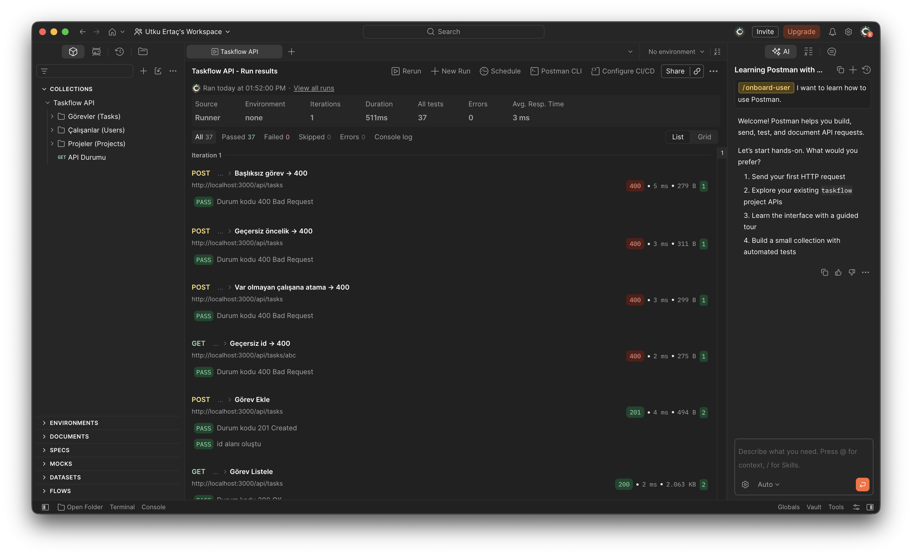

# Taskflow

**Görev ve Proje Yönetim Sistemi REST API'si.** Node.js ile Backend Programlama bitirme projesi.

Bir yazılım şirketinin ekip içindeki görevleri, projeleri ve çalışanların sorumluluklarını takip etmesi için geliştirilmiş, Node.js ve Express.js tabanlı bir REST API'dir. Görevler oluşturulabilir, çalışanlara atanabilir, durumları takip edilebilir ve önceliklendirilebilir.

## Dokümanlar

| Doküman | Açıklama |
|---|---|
| [Proje Tanıtım Dokümanı](docs/01-proje-tanitim.md) | Projenin amacı, senaryosu ve temel özellikleri |
| [Veri Modeli Tasarımı](docs/02-veri-modeli.md) | Çalışan, proje ve görev veri yapıları ve ilişkileri |
| [API Tasarım Dokümanı](docs/03-api-tasarim.md) | Mimari, endpoint listesi, örnek istekler ve hata kodları |
| [Postman Collection](postman/Taskflow.postman_collection.json) | Tüm endpoint'ler için hazır test istekleri |

## Gereksinimler

- [Node.js](https://nodejs.org/) 18 veya üzeri (geliştirme Node.js 24 ile yapıldı)
- npm (Node.js ile birlikte gelir)
- [Postman](https://www.postman.com/downloads/) (testler için)

Kurulu sürümleri kontrol etmek için:

```bash
node -v
npm -v
```

## Kurulum

**1. Projeyi indirin**

```bash
git clone https://github.com/utkuertac/taskflow.git
cd taskflow
```

Git kullanmıyorsanız GitHub sayfasındaki **Code → Download ZIP** ile indirip klasörü açabilirsiniz.

**2. Bağımlılıkları kurun**

```bash
npm install
```

**3. Örnek verileri yükleyin**

```bash
npm run seed
```

Bu komut `data/` klasörünü 3 çalışan, 2 proje ve 4 görev içeren örnek verilerle oluşturur veya sıfırlar. `data/` klasörü çalışma sırasında değiştiği için git'e eklenmez; seed çalıştırılmazsa API boş listelerle başlar.

**4. Sunucuyu başlatın**

```bash
npm start
```

Konsolda şu mesajı görmelisiniz:

```
Taskflow API çalışıyor: http://localhost:3000/api
```

Tarayıcıda [http://localhost:3000/api](http://localhost:3000/api) adresini açarak API'nin çalıştığını doğrulayabilirsiniz.

### Komutlar

| Komut | Açıklama |
|---|---|
| `npm start` | Sunucuyu başlatır |
| `npm run dev` | Geliştirme modu: kod değiştikçe sunucu otomatik yeniden başlar |
| `npm run seed` | Verileri örnek kayıtlarla sıfırlar |

Varsayılan port `3000`'dir. Farklı bir port için: `PORT=4000 npm start`

## Endpoint'ler

Temel URL: `http://localhost:3000/api`

| Metot | Görevler | Çalışanlar | Projeler | İşlem |
|---|---|---|---|---|
| `GET` | `/tasks` | `/users` | `/projects` | Listeleme |
| `GET` | `/tasks/:id` | `/users/:id` | `/projects/:id` | Detay |
| `POST` | `/tasks` | `/users` | `/projects` | Ekleme |
| `PUT` | `/tasks/:id` | `/users/:id` | `/projects/:id` | Güncelleme |
| `DELETE` | `/tasks/:id` | `/users/:id` | `/projects/:id` | Silme |

Örnek görev oluşturma isteği:

```bash
curl -X POST http://localhost:3000/api/tasks \
  -H "Content-Type: application/json" \
  -d '{"title":"API dokümantasyonu","priority":"high","assigneeId":1,"projectId":1}'
```

Alanların ve kuralların ayrıntısı için [API Tasarım Dokümanı](docs/03-api-tasarim.md)'na bakın.

## Logger

Her API isteği method, endpoint, zaman damgası, durum kodu ve süre bilgisiyle hem konsola hem de `logs/requests.log` dosyasına yazılır:

```
[2026-10-01T10:19:56.836Z] POST /api/tasks 201 - 3ms
```

Postman testleri sırasında sunucu konsolundaki logger çıktısı:



## Postman ile Test

1. Sunucuyu başlatın (`npm run seed` ve ardından `npm start`).
2. Postman'de **Import** butonuna tıklayın ve `postman/Taskflow.postman_collection.json` dosyasını seçin.
3. **Taskflow API** collection'ındaki istekleri sırayla çalıştırın veya collection'a sağ tıklayıp **Run collection** ile hepsini tek seferde çalıştırın.

"Ekle" isteği oluşturulan kaydın `id` değerini otomatik olarak kaydeder. Detay, güncelleme ve silme istekleri bu değeri kullanır. Her isteğin **Tests** sekmesinde durum kodunu ve yanıtı doğrulayan kontroller bulunur.

### Test Ekran Görüntüleri

**Görev ekleme: `POST /api/tasks` → 201**


**Görev listeleme: `GET /api/tasks` → 200**


**Görev detayı: `GET /api/tasks/:id` → 200**


**Görev güncelleme: `PUT /api/tasks/:id` → 200**


**Görev silme: `DELETE /api/tasks/:id` → 204**


**Tüm collection: Run collection sonucu**


## Proje Yapısı

```
taskflow/
├── src/
│   ├── server.js              # Sunucuyu başlatır
│   ├── app.js                 # Express uygulaması ve middleware sırası
│   ├── routes/                # URL → controller eşleştirmeleri
│   ├── controllers/           # İstek işleme ve kontroller
│   ├── middlewares/           # logger, notFound (404), errorHandler (500)
│   └── utils/                 # JSON veri katmanı ve yardımcı fonksiyonlar
├── data/                      # tasks.json, users.json, projects.json (npm run seed oluşturur, git'te yok)
├── scripts/seed.js            # Örnek veri yükleyici
├── docs/                      # Dokümanlar ve ekran görüntüleri
├── postman/                   # Postman collection
└── package.json
```

## Kullanılan Teknolojiler

- Node.js
- Express.js 5
- fs/promises (JSON dosya işlemleri)
- Postman
